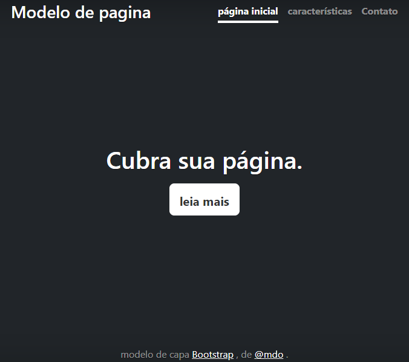

# Indice

[Projeto de portifolio pessoal](#projeto-de-portf%C3%B3lio)  
[Descriação](#descria%C3%A7%C3%A3o)  
[Funcionalidades](#funcionalidades)  
[Tecnologias utilizadas](#tecnologias-utilizadas)  
[fontes consultadas](#fontes-consultadas)  
[Autores](#autores)  

# Projeto escrita do README

# Projeto de portfólio

Projeto criado utilizando exemplo do boostrap para ensino de uso do README e do Bootstrap.

## Descriação
o propósito deste projeo, o objetivo, foi aprimorar as habilidades relacionadas.

## Introdução
projeto usado para praticar README em trabalhos

## Funcionalidades
o projeto não é nada mais que a capa inicial, para aprendizado do README.

### tecnologias utilizadas 
visual estudio code
git hub 

## fontes consultadas
https://gist.github.com/lohhans/f8da0b147550df3f96914d3797e9fb89
https://www.alura.com.br/artigos/escrever-bom-readme

## Autores